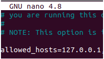

Instalamos apache

Actualizamos los repositorios

sudo apt update

Descargamos apache2

sudo apt-get install -y apache2

Instalamos PHP

sudo apt-get install -y libapache2-mod-php

Instalamos Postgresql para administrar la BD

sudo apt install -y postgresql-12

Creamos al usuario admin

~$ sudo -u postgres createuser --interactive admin

~$ createdb Nagiosbd -O admin

Editamos el fichero pg_hba.conf para poder hacer uso de nuestra contraseña.

Y reiniciamos el servicio

sudo systemctl restart postgresql

Instalamos PHPph

sudo apt install -y phppgadim

E instalamos Nagios

Instalamos el plugin nagios
wget -q https://github.com/nagios-plugins/nagios-plugins/releases/download/release-2.4.0/nagios-plugins-2.4.0.tar.gz

E instalamos las dependencias necesarias para Nagios
 sudo apt-get install -y fping libcrypt-x509-perl libdatetime-format-dateparse-perl libdbi-dev libkrb5-dev libldap2-dev libmysqlclient-dev libnet-snmp-perl libssl-dev libtext-glob-perl libwww-perl postgresql-server-dev-12 qstat rpcbind smbclient snmp

Creamos una carpeta en el escritorio> mkdir Nagios y descomprimimos dentro el fichero:
tar xf nagios-plugins-2.4.0.tar.gz

Y hacemos la configuración
 ./configure/
make
sudo make install

Descargamos e instalamos Nagios Core para monitorizar el equipo
wget -q https://github.com/NagiosEnterprises/nagioscore/releases/download/nagios-4.4.7/nagios-4.4.7.tar.gz
sudo apt install -y libgd-dev libltdl-dev traceroute un

Creamos una carpeta en el escritorio y descomprimimos el fichero:
 tar xf nagios-4.4.7.tar.gz

Configuramos
./configure --disable-ssl
make all

E instalamos el servicio
sudo make install-groups-users install install-webconf install-config install-init install-daemoninit install-commandmode

Y añadimos al usuario anterior
sudo usermod -a -G admin www-data

Iniciamos el servicio
 sudo systemctl start nagios

Preparamos el servicio web.
sudo a2enmod cgi

Y reiniciamos el servicio.
 sudo systemctl restart apache2

Creamos un usuario admin
sudo htpasswd -c /usr/local/nagios/etc/htpasswd.users adminnag

Entramos desde cualquier navegador

Logeamos y nos saldrá la configuración general que habremos hecho de nuestro localhost.

Instalamos NRPE en el sevidor y el equipo 

wget -q https://github.com/NagiosEnterprises/nrpe/releases/download/nrpe-4.0.3/nrpe-4.0.3.tar.gz
sudo apt install -y libwrap0-dev

Descomprimimos en una carpeta que hayamos creado en el escritorio del cliente: 
Sudo mkdir nrpe> tar xf nrpe-4.0.3.tar.gz

Configuramos
./configure
make nrpe
sudo make install-groups-users install-daemon install-config install-init

Editamos el fichero nrpe.cfg 
sudo nano /usr/local/nagios/etc/nrpe.cfg

Y añadiremos la línea 
“Allowed_hosts=127.0.0.1”

Y empezaremos a ejecutar el servicio nrpe
sudo ufw allow nrpe
sudo systemctl start nrpe

En el servidor	

Creamos una carpeta en el escritorio del servidor llamada nrpe y descomprimimos dentro el paquete:
Sudo mkdir nrpe>tar xf nrpe-4.0.3.tar.gz
./configure
make check_nrpe
sudo make install-groups-users install-daemon install-config install-init

Configuramos el NRPE
sudo nano /usr/local/nagios/etc/objects/commands.cfg 

Y añadimos la siguiente línea.
        command_line $USER1$/check_nrpe -H $HOSTADDRESS$ -c $ARG1$

define command {
        command_name check_nrpe

Y reiniciamos el servicio
sudo systemctl restart nagios

Conectamos el servidor con la máquina que vamos a monitorizar
sudo mkdir /usr/local/nagios/etc/clientes

Y cambiaremos el fichero nagios.cfg para borrar el siguiente comentario.
 Cfg_dir=/usr/local/nagios/etc/clientes

Y entramos en la configuración de nuestro cliente
sudo nano /usr/local/nagios/etc/servers/cliente.cfg
añadiremos las siguientes líneas.

Instalamos apache

Actualizamos los repositorios

sudo apt update

Descargamos apache2

sudo apt-get install -y apache2

Instalamos PHP

sudo apt-get install -y libapache2-mod-php

Instalamos Postgresql para administrar la BD

sudo apt install -y postgresql-12

Creamos al usuario admin

~$ sudo -u postgres createuser --interactive admin

~$ createdb Nagiosbd -O admin

Editamos el fichero pg_hba.conf para poder hacer uso de nuestra contraseña.

Y reiniciamos el servicio

sudo systemctl restart postgresql

Instalamos PHPph

sudo apt install -y phppgadim

E instalamos Nagios

Instalamos el plugin nagios

wget -q https://github.com/nagios-plugins/nagios-plugins/releases/download/release-2.4.0/nagios-plugins-2.4.0.tar.gz

E instalamos las dependencias necesarias para Nagios

 sudo apt-get install -y fping libcrypt-x509-perl libdatetime-format-dateparse-perl libdbi-dev libkrb5-dev libldap2-dev libmysqlclient-dev libnet-snmp-perl libssl-dev libtext-glob-perl libwww-perl postgresql-server-dev-12 qstat rpcbind smbclient snmp
 
 
Creamos una carpeta en el escritorio> mkdir Nagios y descomprimimos dentro el fichero:

tar xf nagios-plugins-2.4.0.tar.gz

Y hacemos la configuración
 ./configure/
 
make

sudo make install

Descargamos e instalamos Nagios Core para monitorizar el equipo

wget -q https://github.com/NagiosEnterprises/nagioscore/releases/download/nagios-4.4.7/nagios-4.4.7.tar.gz

sudo apt install -y libgd-dev libltdl-dev traceroute un

Creamos una carpeta en el escritorio y descomprimimos el fichero:

 tar xf nagios-4.4.7.tar.gz
 
 
Configuramos

./configure --disable-ssl

make all

E instalamos el servicio

sudo make install-groups-users install install-webconf install-config install-init install-daemoninit install-commandmode

Y añadimos al usuario anterior

sudo usermod -a -G admin www-data

Iniciamos el servicio

 sudo systemctl start nagios
 
 
Preparamos el servicio web.

sudo a2enmod cgi

Y reiniciamos el servicio.

 sudo systemctl restart apache2
 
 
Creamos un usuario admin

 sudo htpasswd -c /usr/local/nagios/etc/htpasswd.users adminnag
 

Entramos desde cualquier navegador

Logeamos y nos saldrá la configuración general que habremos hecho de nuestro localhost.

Instalamos NRPE en el sevidor y el equipo 

wget -q https://github.com/NagiosEnterprises/nrpe/releases/download/nrpe-4.0.3/nrpe-4.0.3.tar.gz
sudo apt install -y libwrap0-dev

Descomprimimos en una carpeta que hayamos creado en el escritorio del cliente: 
Sudo mkdir nrpe> tar xf nrpe-4.0.3.tar.gz

Configuramos
./configure
make nrpe
sudo make install-groups-users install-daemon install-config install-init

Editamos el fichero nrpe.cfg 
sudo nano /usr/local/nagios/etc/nrpe.cfg

Y añadiremos la línea 
“Allowed_hosts=127.0.0.1”

Y empezaremos a ejecutar el servicio nrpe
sudo ufw allow nrpe
sudo systemctl start nrpe

En el servidor	

Creamos una carpeta en el escritorio del servidor llamada nrpe y descomprimimos dentro el paquete:
Sudo mkdir nrpe>tar xf nrpe-4.0.3.tar.gz
./configure
make check_nrpe
sudo make install-groups-users install-daemon install-config install-init

Configuramos el NRPE
sudo nano /usr/local/nagios/etc/objects/commands.cfg 

Y añadimos la siguiente línea.
        command_line $USER1$/check_nrpe -H $HOSTADDRESS$ -c $ARG1$

define command {
        command_name check_nrpe

Y reiniciamos el servicio
sudo systemctl restart nagios

Conectamos el servidor con la máquina que vamos a monitorizar
sudo mkdir /usr/local/nagios/etc/clientes

Y cambiaremos el fichero nagios.cfg para borrar el siguiente comentario.
 Cfg_dir=/usr/local/nagios/etc/clientes

Y entramos en la configuración de nuestro cliente
sudo nano /usr/local/nagios/etc/servers/cliente.cfg

Añadiremos las siguientes líneas.

Dentro del mismo .cfg añadiremos una línea más que nos permitirá monitorizar la página web.
sudo nano /usr/local/nagios/etc/servers/cliente.cfg
 define host {
host_name=IESDPM
address= 81.88.48.71
}

